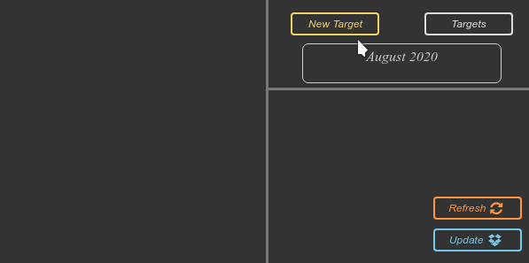
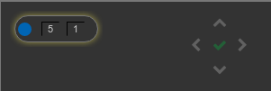

# Pomodoro

## General Info

Technology used:
* Python, Flask - backend
* Electron (HTML, CSS, JS) - frontend

Running application add its icon at system notification area (Tray).

At this stage of developing app all targets are serialized with `pickle` module and stored in file.

## Usage

```
git clone https://github.com/artsR/Pomodoro.git
cd Pomodoro
npm install
cd pomodoro
pipenv shell
pipenv install
export DROPBOX_KEY=your_dropbox_key
npm start
```

## App Overview

Application is desktop extension to time management apps that track and collect time spent
on given tasks/projects. It is based on csv file of given structure produced by mentioned apps.   

With this application you can:
* download prepared csv file from Dropbox
* specify monthly target [hours] to spent on given activity
    * add new target
    * edit existing one
* track progress of time spending on given task in relation to target
* track how many free days you have left
* track how many hours per day you need to spent on task to meet target
* customize day start hour




Buttons:
* Update: download csv file from Dropbox
* Refresh: 're-calculate' csv file to determine progress

Pilot:  

* hours per day to reach tearget: 5
* free days left: 1
It can be modified with 'pilot' (appropriate arrows)
